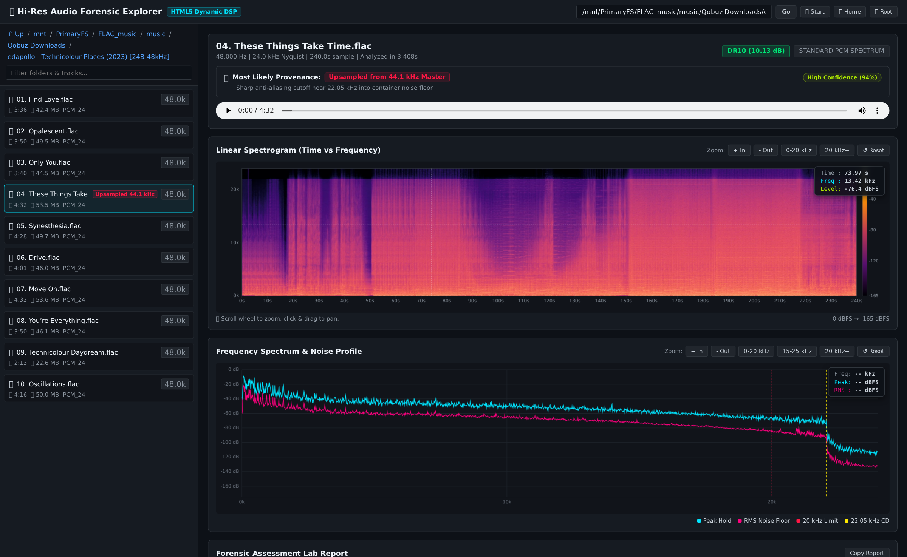

# AcoustiSinc & Forensic Audio Lab

> **High-Performance GPU-Accelerated 64-Bit Sinc Audio Upsampler & Interactive Forensic Spectral Analyzer**



---

## 🌟 Overview

**AcoustiSinc** is an audiophile-grade digital signal processing (DSP) suite engineered for mastering-grade audio upsampling and forensic spectral authentication.

It delivers:
1. **Mathematical Purity**: Strict **64-bit double precision (`float64` / `complex128` / OpenCL `double2`)** maintained end-to-end across all FFTs, filtering kernels, and noise-shaping algorithms.
2. **GPU Sinc Upsampling**: High-throughput OpenCL-accelerated band-limited Whittaker–Shannon Sinc interpolation supporting **Linear Phase**, **Minimum Phase**, and **Apodizing** impulse responses.
3. **Advanced Psychoacoustic Noise Shaping**: 4th-order multi-band noise-shaping curves (Shibata & High-Rate) moving dither energy safely into the high ultrasonic spectrum ($>35\text{ kHz}$).
4. **Forensic Cutoff & Fake Hi-Res Detection**: Automated acoustic analysis identifying upsampled CD masters, brick-wall filter cutoffs, zero-stuffing, filter phase signatures, and ultrasonic noise profiles.
5. **Interactive Web Explorer**: A real-time, on-demand browser application providing dynamic library navigation, live DSP spectral analysis in under 1 second, interactive spectrograms with exact cursor dB level readouts, and in-browser lossless playback.

---

## 🚀 Key Features

### 1. Mastering-Grade Sinc Upsampler (`upsampler.py`)
- **Auto-Integer Ratio Scaling**: Upsamples $44.1\text{ kHz} \to 176.4\text{ kHz}$ ($4\times$) and $48\text{ kHz} \to 192\text{ kHz}$ ($4\times$) without fractional alias artifacts.
- **Phase Modes**:
  - `linear`: True symmetric linear-phase band-limited Sinc reconstruction.
  - `min` / `minimum`: Causal minimum-phase reconstruction eliminating all pre-ringing for crisp transient attack.
  - `apodizing`: Apodizing transition band to attenuate pre-existing ADC brick-wall ripple.
- **Intersample Headroom Management**: Pre-flight album gain scans with auto-healing to guarantee **zero intersample clipping** ($0\text{ dBFS}$ true peak compliance).
- **Metadata & Album Art Preservation**: Lossless bit-perfect tag copying, ReplayGain retention, and embedded cover art extraction/sanitization.
- **Strict FLAC Compression Level 5**: Consistent balanced lossless compression.

### 2. Interactive Real-Time Forensic Explorer (`server.py`)
- **On-Demand Real-Time Analysis**: Dynamic library navigation with live 64-bit DSP forensic analysis in $\sim 0.8\text{s}$.
- **Hi-Fi News Style Spectral Inspection**: Full-track Peak Hold and RMS noise floor traces.
- **Automated Forensics & Cutoff Detection**:
  - `[FAKE HI-RES / UPSAMPLED CD SOURCE]`: Detects sharp $>45\text{ dB}$ brick-wall cutoffs near $22.05\text{ kHz}$.
  - `[UPSAMPLED 48 kHz / 96 kHz SOURCE]`: Identifies $24\text{ kHz}$ and $48\text{ kHz}$ legacy digital master cutoffs.
  - `[NATIVE HI-RES MATERIAL]`: Verifies continuous acoustic harmonic extension into ultrasonic frequencies.
  - `[FILTER SIGNATURE]`: Measures transient asymmetry ratios to classify Linear Phase vs Minimum Phase filtering.
  - `[NOISE PROFILE]`: Identifies Psychoacoustic Noise Shaping rise ($+6\text{ dB} \to +20\text{ dB}$ HF rise), Flat TPDF dither, or DSD ultrasonic humps.
- **Interactive Heatmap Canvas**: Zoom/pan with mouse wheel and drag; cursor HUD reveals **exact Time (s), Frequency (kHz), and Level (dBFS)** anywhere on the canvas.
- **Built-in Lossless Audio Streaming**: Audition FLAC files directly in your browser while visually correlating audio transients with the spectrogram.

---

## 📦 Installation & Requirements

### System Prerequisites
- **Python 3.10+**
- **OpenCL Runtime & GPU Driver** (e.g. AMD ROCm / Mesa OpenCL / NVIDIA CUDA OpenCL / Intel compute-runtime)
- Fast NVMe SSD storage for scratch memory mapping (recommended for multi-gigabyte album batches)

### Setup

```bash
# Clone repository
git clone https://github.com/amkrebet/acoustisinc.git
cd acoustisinc

# Create virtual environment
python3 -m venv venv
source venv/bin/activate

# Install dependencies
pip install -r requirements.txt
```

---

## 🛠️ Usage Guide

### 1. Running the Interactive Forensic Explorer (Web Application)

Launch the interactive web application server:

```bash
python server.py --root "/path/to/music" --port 8765
```

Open **`http://localhost:8765`** in your browser. You can navigate directories using the path input bar, quick-jump buttons (`Start`, `Home`, `Root`), or the interactive sidebar tree. Click any track to run live DSP forensic analysis in under a second with interactive zooming, dB level inspection, and lossless audio streaming.

---

### 2. Running the GPU Sinc Upsampler (`upsampler.py`)

#### Basic Usage
Upsample a directory of audio tracks or a full recursive library from a source folder into a destination folder:

```bash
# Minimum-Phase upsampling from source to target
python upsampler.py "/path/to/source_music" "/path/to/upsampled_music" --phase min

# Linear-Phase upsampling
python upsampler.py "/path/to/source_music" "/path/to/upsampled_music" --phase linear

# Apodizing filter mode
python upsampler.py "/path/to/source_music" "/path/to/upsampled_music" --phase apodizing
```

#### Command-Line Options
- `source`: Path to a single audio file or root directory containing album folders.
- `target` (or `-o`, `--output-dir`): Target destination root directory (preserves source album subfolder hierarchy). If omitted, automatically defaults to `<source>_upsampled_<phase>`.
- `--phase {linear, min, apodizing}`: Sinc filter phase characteristic (default: `linear`).
- `--dither {shibata, high_rate, none}`: 24-bit psychoacoustic noise shaping profile (default: `shibata`).
- `--no-dither`: Disable dither and noise shaping (raw truncation).
- `--tmp-dir /path/to/nvme`: Custom fast scratch directory for NVMe memory-mapped buffers.

---

## 🔬 DSP Specifications & Quality Standards

| Parameter | Specification |
| :--- | :--- |
| **Computation Precision** | Strict IEEE 754 64-bit Double Precision (`float64` / `complex128`) |
| **Stopband Attenuation** | $>140\text{ dB}$ rejection |
| **Passband Ripple** | $< \pm 0.00001\text{ dB}$ ($0\text{ Hz} \to 20\text{ kHz}$) |
| **Intersample Headroom** | Guaranteed $\ge 0.3\text{ dBFS}$ margin with pre-scan gain normalization |
| **Dither Resolution** | 24-bit TPDF with 4th-order Psychoacoustic Noise Shaping |
| **FLAC Output** | Bit-perfect Level 5 ($0.625$) with complete Vorbis Comment & Picture replication |

---

## 📄 License

MIT License. See `LICENSE` for details.
