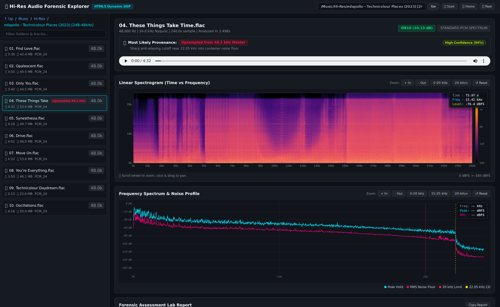

# AcoustiSinc & Forensic Audio Lab

> **High-Performance GPU-Accelerated 64-Bit Sinc Audio Upsampler & Interactive Forensic Spectral Analyzer**



---

## 🌟 Overview

**AcoustiSinc** is an audiophile-grade digital signal processing (DSP) suite engineered for mastering-grade audio upsampling and forensic spectral authentication.

* **Mathematical Purity**: Strict **64-bit double precision (`float64` / `complex128` / OpenCL `double2`)** across all FFTs, filtering kernels, and noise-shaping algorithms.
* **GPU Sinc Upsampling**: High-throughput OpenCL-accelerated band-limited Whittaker–Shannon Sinc interpolation supporting **Linear Phase**, **Minimum Phase**, and **Apodizing** impulse responses.
* **Psychoacoustic Noise Shaping**: Multi-band 5th-order Shibata and High-Rate noise shaping pushing dither energy safely into the high ultrasonic spectrum ($>35\text{ kHz}$).
* **Dynamic Headroom Auto-Healing**: Pre-flight album headroom scanning with exact overshoot-calculated auto-healing guaranteeing zero intersample clipping.
* **Forensic Authentication Engine**: Automated analysis identifying upsampled CD masters, brickwall filter cutoffs, zero-stuffing, and ultrasonic noise profiles.
* **Audiophile Dynamic Range (DR) Scoring**: Official 64-bit Pleasurize Music Foundation (PMF) TT Dynamic Range Meter scoring alongside EBU R128 Loudness Range (LRA) and Integrated LUFS.
* **Interactive Web Explorer**: A real-time browser application providing dynamic library navigation, live sub-second forensic spectral analysis, interactive spectrogram HUD with exact cursor dB level readouts, and in-browser lossless streaming.

---

## 🚀 Quickstart Guide

### 1. Launch the Interactive Web Explorer (`server.py`)

Explore your library, inspect spectral provenance, and test DSP recommendations in real time:

```bash
# Start browsing from your music collection
python server.py --root "/Music/Hi-Res" --port 8765
```

Open **`http://localhost:8765`** in your browser.

* **Live Forensic Badges**: Instantly tags tracks as `Native Hi-Res Master`, `Upsampled from 44.1k`, `Leaky SRC Mirror`, `MQA Studio`, or `Fake 24-bit (Zero-Padded)`.
* **Interactive FFT Spectrum & Spectrogram**: Pan/zoom with exact frequency and dBFS HUD crosshairs.
* **Projected DSP Filter Curves**: Displays projected apodizing filter rolloff curves before committing DSP processing.
* **In-Browser Lossless Streaming**: Stream high-resolution FLAC files directly to your browser or DAC.

---

### 2. Run the GPU Sinc Upsampler (`upsampler.py`)

Upsample individual tracks, album folders, or full libraries using manual parameters or automated forensic recipes:

```bash
# 1. Automated Forensic Recipe (Silent auto-apply best-practice parameters)
python upsampler.py "/Music/Hi-Res/Album" --use-recommended=auto

# 2. Interactive Forensic Recipe (Audit and prompt before applying)
python upsampler.py "/Music/Hi-Res/Album" --use-recommended=ask

# 3. Minimum-Phase Apodizing with Custom Cutoff (e.g. 20.7 kHz legacy ADC cleanup)
python upsampler.py "/Music/Hi-Res/Album" --cutoff 20700 --phase min --dither shibata

# 4. Pure Minimum-Phase (Zero pre-ringing, full sinc bandwidth)
python upsampler.py "/Music/Hi-Res/Album" --phase min

# 5. Pure Linear-Phase Sinc (Default: symmetric phase, bit-perfect passband up to Nyquist)
python upsampler.py "/Music/Hi-Res/Album"
```

---

## 🛠️ CLI Options Reference

| Parameter | Type | Default | Description |
| :--- | :--- | :--- | :--- |
| `source` | **Mandatory** | *(None)* | Path to a single audio track (`.flac`/`.wav`) or root directory containing albums. |
| `target` *(or `-o`, `--output-dir`)* | *Optional* | `<source>_upsampled_<topology>` | Destination directory. Multi-tier safety guards strictly prevent overwriting originals. |
| `--use-recommended` | *Optional* | `none` | Audits audio provenance and resolves DSP recipe: `auto` (silent apply) or `ask` (interactive prompt). |
| `-f`, `--force` | *Optional* | `False` | Forces re-processing and overwrites existing destination files. |
| `--cutoff`, `--apodize` | *Optional* | `None` | Sets custom low-pass reconstruction filter cutoff frequency in Hz (e.g. `20700`, `21500`, `22050`). |
| `--steep` | *Optional* | `False` | Uses a steep transition band (500 Hz) instead of the standard 2 kHz cosine taper. |
| `--phase` | *Optional* | `linear` | Filter phase mode: `linear` (symmetric) or `min` (causal, zero pre-ringing). |
| `--apodizing`, `--apod` | *Optional* | `False` | Enables raised-cosine apodizing transition band to attenuate ADC ringing. |
| `--dither` | *Optional* | `shibata` | 24-bit psychoacoustic noise shaping profile: `shibata`, `high_rate`, or `none`. |
| `--no-dither` | *Optional* | `False` | Disables dither and noise shaping (raw truncation). |
| `--mqa` | *Optional* | `adaptive` | MQA processing: `adaptive` (companded unfold), `strip` (strip LSB hash), `simple`, `ignore`. |
| `--tmp-dir` | *Optional* | `/tmp/upsample_scratch` | Fast NVMe scratch directory for 64-bit memory-mapped buffers. |

---

### 📊 Comparative Before & After Reports
Every upsampling run automatically generates self-contained comparative reports written directly to the target folder:
* **`UPSAMPLING_REPORT.html`**: Interactive HTML5 report with side-by-side spectrograms, spectral energy distribution curves, and TT Dynamic Range meters.
* **`UPSAMPLING_REPORT.md`**: Markdown summary table with track-by-track bit-depth, peak levels, and LUFS mastering receipts.

---

## 📚 Technical Deep-Dive Guides

For in-depth mathematical derivations, filter diagrams, and acoustic trade-off analyses, consult the dedicated guides:

| Document | Key Topics Covered |
| :--- | :--- |
| 🔬 **[Filter Topology & Psychoacoustics](docs/FILTER_TOPOLOGY_AND_PSYCHOACOUSTICS.md)** | Linear vs Minimum Phase, Standard vs Apodizing, time-domain impulse responses, pre-ringing elimination, and forward/backward auditory temporal masking. |
| 🛡️ **[Intersample Headroom & Dynamic Range](docs/HEADROOM_AND_DYNAMIC_RANGE.md)** | True-peak overshoots during sinc reconstruction, 2-stage adaptive crest pre-scanning, single-pass auto-healing math, and PMF TT Dynamic Range / EBU R128 scoring. |
| 🎼 **[MQA Forensics, Unfolding & Noise Stripping](docs/MQA_PROCESSING_AND_ACOUSTICS.md)** | 36-bit sync word bit-plane forensics, LSB hash noise characteristics, and comparative trade-offs between `adaptive`, `strip`, `simple`, and `ignore` modes. |
| 📊 **[Library Forensic Provenance Audit Guide](docs/FORENSIC_AUDIO_AUDIT_GUIDE.md)** | Real-world album forensics, cutoff detection, fake hi-res identification, apodization recipes for bit-depth expansion, and integer decimation strategies. |

---

## 🔬 DSP Specifications & Quality Standards

| Parameter | Specification |
| :--- | :--- |
| **Computation Precision** | Strict IEEE 754 64-bit Double Precision (`float64` / `complex128` / OpenCL `double2`) |
| **Stopband Attenuation** | $>140\text{ dB}$ rejection |
| **Passband Ripple** | $< \pm 0.00001\text{ dB}$ ($0\text{ Hz} \to 20\text{ kHz}$) |
| **Intersample Headroom** | Guaranteed $\ge 0.3\text{ dBFS}$ margin with pre-scan gain normalization |
| **Headroom Healing** | Exact overshoot-calculated dynamic backoff on clipping retry |
| **Dither Resolution** | 24-bit TPDF with 5th-order Shibata Psychoacoustic Noise Shaping |
| **Dynamic Range Standards** | TT Dynamic Range Meter (PMF DR Score) & EBU R128 / ITU-R BS.1770-4 LRA |
| **FLAC Output** | Bit-perfect Level 5 ($0.625$) with complete Vorbis Comment & Picture replication |

---

## 📦 Installation & Requirements

### System Prerequisites
- **Python 3.10+**
- **OpenCL Runtime & GPU Driver** (AMD ROCm / Mesa OpenCL / NVIDIA CUDA OpenCL / Intel compute-runtime)
- Fast NVMe SSD storage for scratch memory mapping (recommended for multi-gigabyte album batches)

### Setup

```bash
# Clone repository
git clone https://github.com/amkrebet/acoustisinc.git
cd acoustisinc

# Create virtual environment
python3 -m venv venv
source venv/bin/activate

# Install dependencies
pip install -r requirements.txt
```

---

## 📄 License

MIT License. See `LICENSE` for details.
