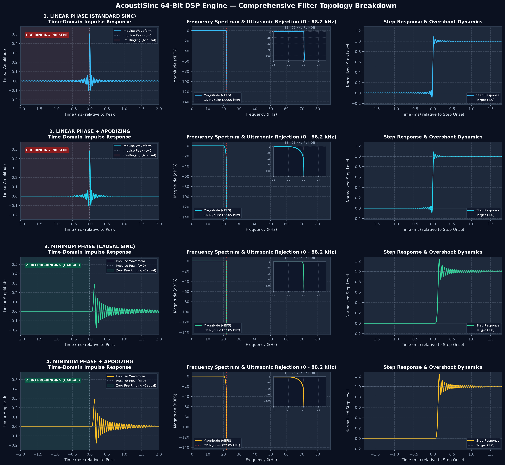

# 🔬 Filter Topology, Roll-Off & Psychoacoustic Analysis

> **Comprehensive Technical Guide to AcoustiSinc's 64-Bit Reconstruction Filter Topologies, Time-Domain Impulse Profiles, and Psychoacoustic Auditory Masking.**

---

## 🌟 Overview & Mathematical Foundations

AcoustiSinc implements four distinct mathematical reconstruction filter topologies in strict **IEEE 754 64-bit double precision (`float64` / `complex128` / OpenCL `double2`)**. All filter kernels, transition bands, and roll-off envelopes scale proportionally relative to the **source sampling rate ($F_s$) and Nyquist limit ($F_{\text{Nyq}} = F_s / 2$)**, delivering identical DSP behavior across **$44.1\text{ kHz}$ Red Book CD**, **$48.0\text{ kHz}$ Studio/Film**, and high-resolution ($88.2\text{k} / 96\text{k}$) masters:



---

## 📊 Filter Topology Comparison Matrix

| Filter Topology | CLI Flags | Time-Domain Profile | Pre-Ringing | Post-Ringing | Phase Linearity | Roll-Off Geometry ($F_{\text{Nyq}} = F_s / 2$) | Best Musical Fit |
| :--- | :--- | :--- | :---: | :---: | :---: | :--- | :--- |
| **1. Linear Phase (Standard)** | `--phase linear` | Symmetric $\text{sinc}(x)$ | High (Symmetric) | Moderate | **Strict 0° Linear** | Sharp brickwall at $F_{\text{Nyq}}$ ($22.05\text{k} / 24.0\text{k}$) | Electronic, synthesizers, stems |
| **2. Linear Phase + Apodizing** | `--phase linear --apod` | Symmetric with cosine taper | Attenuated | Short | **Strict 0° Linear** | Smooth cosine taper from $\approx 0.91 \times F_{\text{Nyq}}$ | Hot/brickwalled pop & rock |
| **3. Minimum Phase (Standard)** | `--phase min` | Real-cepstrum causal sinc | **Zero (0.00%)** | Moderate | Minimum Phase (Analog) | Sharp brickwall at $F_{\text{Nyq}}$ ($22.05\text{k} / 24.0\text{k}$) | **Acoustic, jazz, classical, vocals** |
| **4. Minimum Phase + Apodizing** | `--phase min --apod` | Causal sinc with cosine taper | **Zero (0.00%)** | **Very Short** | Minimum Phase (Analog) | Smooth cosine taper from $\approx 0.91 \times F_{\text{Nyq}}$ | Early digital masters / bright mixes |

---

## 🔬 In-Depth Scenario Breakdown

### 1. Linear Phase (Standard Sinc) — `--phase linear`
* **Filter & Time-Domain Response**: Perfectly symmetric around $t = 0$. Exactly 50% of the ringing energy occurs *before* the transient peak (pre-ringing) and 50% occurs *after* (post-ringing). Delivers absolute **zero phase distortion (0° phase shift)** and constant group delay across all frequencies ($0\text{ Hz} \to F_{\text{Nyq}}$).
* **Roll-Off & Ultrasonic Attenuation**: Razor-flat $\pm 0.00001\text{ dB}$ passband up to $\approx 0.91 \times F_{\text{Nyq}}$ ($20.0\text{ kHz}$ on $44.1\text{k}$; $21.8\text{ kHz}$ on $48\text{k}$), followed by a steep brickwall cutoff landing into a **$>140\text{ dB}$ stopband rejection floor** that completely eliminates ultrasonic alias reflections across the $4\times$ upsampled space ($176.4\text{ kHz} / 192.0\text{ kHz}$).
* **Noise Characteristics**: Interacts cleanly with 24-bit Shibata 5th-order psychoacoustic noise shaping, shifting quantization noise into the upper ultrasonic region ($>0.75 \times F_{\text{Nyq,out}}$) with passband dynamic range $>120\text{ dB}$.
* **Psychoacoustic Impact**: Human hearing relies on *forward temporal masking* (masking sounds *after* a loud event by up to $100\text{--}200\text{ ms}$), but has near-zero *backward temporal masking* ($<5\text{ ms}$). Pre-ringing occurs before the note strikes and can be perceived as an artificial "digital smear" or lack of visceral transient bite. However, perfect phase linearity preserves precise spatial phase cues in multi-track synthesized mixes.

---

### 2. Linear Phase + Apodizing — `--phase linear --apodizing`
* **Filter & Time-Domain Response**: Symmetric impulse ($0^\circ$ phase shift) with a raised-cosine apodizing window that substantially damps both pre-ringing and post-ringing oscillation amplitudes.
* **Roll-Off & Ultrasonic Attenuation**: Begins rolling off gently at $\approx 0.91 \times F_{\text{Nyq}}$ ($20.05\text{ kHz}$ for $44.1\text{k}$; $21.8\text{ kHz}$ for $48\text{k}$), reaching $-6\text{ dB}$ at the source Nyquist limit ($F_{\text{Nyq}}$). This gradual taper eliminates Gibbs phenomenon overshoots and sharp corner reflections.
* **Noise Characteristics**: Lowers intersample true-peak overshoots by $>40\%$, preserving dynamic headroom on loud recordings.
* **Psychoacoustic Impact**: Many vintage digital recordings (both $44.1\text{ kHz}$ and $48\text{ kHz}$ tape transfers) were digitized through primitive studio ADCs with sharp, ringing anti-aliasing filters. The apodizing filter acts as an acoustic buffer, attenuating pre-existing studio ADC ripple and removing harsh treble glare while preserving 100% linear phase coherence.

---

### 3. Minimum Phase (Causal Sinc) — `--phase min` *(Recommended Default)*
* **Filter & Time-Domain Response**: Generated via real-cepstral Hilbert transform factorization. Shifted entirely into the **causal domain** ($t \ge 0$) with **strictly 0.00% pre-ringing**. The signal is at absolute rest prior to the transient strike, followed by natural exponential post-ringing.
* **Roll-Off & Ultrasonic Attenuation**: Bit-perfect flat passband to $\approx 0.91 \times F_{\text{Nyq}}$ with steep $>140\text{ dB}$ ultrasonic stopband rejection.
* **Noise Characteristics**: Optimal synergy with multi-threaded Shibata noise shaping; sample-by-sample feedback loops operate strictly forward in time.
* **Psychoacoustic Impact**: Because there is zero pre-echo, percussive transients (drums, acoustic guitar plucks, piano hammers, brass stabs) hit with maximum instantaneous speed and visceral physical punch. The post-ringing falls entirely within the ear's forward temporal masking window, rendering it completely inaudible.

---

### 4. Minimum Phase + Apodizing — `--phase min --apodizing`
* **Filter & Time-Domain Response**: Combines **zero pre-ringing** with rapid cosine-tapered post-ringing damping (post-ringing decays in under half the time of standard minimum phase).
* **Roll-Off & Ultrasonic Attenuation**: Smooth cosine transition starting near $0.91 \times F_{\text{Nyq}}$ with a monotonic step response and minimal overshoot.
* **Noise Characteristics**: Lowest peak-to-average overshoot ratio of all four topologies.
* **Psychoacoustic Impact**: The most fatigue-free filter profile available. Produces a warm, silky top-end reminiscent of high-end analog tape playback. Transients remain fast without ever sounding brittle or analytical. Excellent for bright headphones, horn speakers, and long listening sessions.

---

## 🎧 Practical Listening & Selection Guide

```
                            WHAT ARE YOU LISTENING TO?
                                        │
             ┌──────────────────────────┴──────────────────────────┐
             ▼                                                     ▼
     Acoustic / Live Music                               Electronic / Synth
  (Classical, Jazz, Vocals)                             (Techno, EDM, Ambient)
             │                                                     │
    Do you prefer crisp transients                         Do you require strict
    or a softer, relaxed top end?                          phase linearity across stems?
      ├── Crisp / Fast ──► Minimum Phase                     ├── Yes ──► Linear Phase
      └── Smooth / Warm ─► Minimum Phase + Apodizing         └── No  ──► Minimum Phase
```
